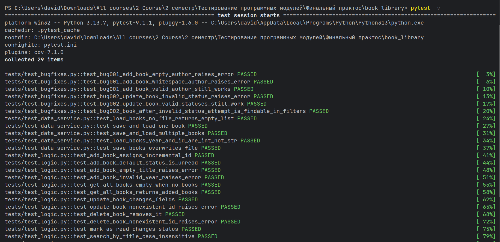

# Итоговый отчёт

## Путь по этапам

Проект «Личная библиотека книг» реализован по полному циклу разработки:

1. **Требования** — составлены user stories, определён MVP, заведены 7 GitHub Issues (#1–#7), создана Kanban-доска с колонками Todo / In Progress / Review / Done.
2. **Проектирование** — описана структура данных (CSV: id, title, author, year, status) и архитектура трёх слоёв: `menu.py → logic.py → data_service.py`.
3. **Разработка по TDD** — сначала написан `data_service.py` (чтение/запись CSV), затем `logic.py` (CRUD, поиск, фильтрация), затем `menu.py`. Каждая функция писалась по циклу тест → код → рефакторинг.
4. **Приёмочное тестирование** — пройден чек-лист из 15 пунктов (`TEST_CHECKLIST.md`) через ручной запуск `menu.py`.
5. **Имитация поддержки** — обработаны 4 обращения: два баг-репорта (BUG-001, BUG-002), одно улучшение (сортировка по году) и закрыт change request/вопрос. Для каждого бага сначала написан тест, воспроизводящий проблему, затем сделан фикс. Результаты зафиксированы в `SUPPORT_LOG.md`, версия повышена до 1.0.2.
6. **Финал** — все изменения проведены через Pull Request, смерджены в `main`.

## Скриншот прогона тестов

)

Итоговый результат: **29 passed in 0.41s**, все тесты зелёные.

## Фрагмент журнала поддержки

| ID | Описание | Решение | Версия |
|----|----------|---------|--------|
| BUG-001 | Пустое имя автора принималось без ошибки | Добавлена валидация `author` в `add_book`, покрыта тестами | 1.0.1 |
| BUG-002 | `update_book` принимал произвольный статус, книга пропадала из фильтров | Добавлена проверка допустимых значений статуса (`read`/`unread`) | 1.0.1 |

(полная таблица — в `SUPPORT_LOG.md`)

## Ответы на вопросы

**Что было самым сложным в тестировании?**

*(впиши своими словами, 2-3 предложения — например, про настройку pytest и пути импорта модулей, или про продумывание краевых случаев)*

**Как изменилось бы приложение, если бы вы сразу знали обо всех багах?**

Если бы баги BUG-001 и BUG-002 были известны заранее, проверки на пустого автора и допустимые значения статуса вошли бы в исходную версию `logic.py` сразу при разработке по TDD, а не добавлялись бы отдельным патчем 1.0.1. Это показывает ценность подхода «тест до кода»: большинство похожих краевых случаев (пустой title, некорректный year) уже были закрыты тестами на этапе разработки — пропустили только проверку author и status, потому что не подумали о них как о «зеркальных» полям title.

**Чему вы научились в процессе «поддержки»?**

*(впиши своими словами — например, про важность теста-репродюсера перед фиксом, про то, что баг — это не повод чинить вслепую, а сначала зафиксировать его тестом)*

## Личная мини-ретроспектива

**Что удалось:**
- Чистое разделение слоёв (data_service / logic / menu) упростило тестирование бизнес-логики без необходимости запускать консольное меню
- Высокое покрытие тестами (95%+) на ключевых модулях
- Баги, найденные при имитации поддержки, были пойманы тестами до фикса, а не чинились "на глаз"

**Что можно улучшить в следующий раз:**
- Продумывать симметричные проверки сразу (если валидируем `title`, сразу проверять и аналогичные поля, например `author`)
- Добавить валидацию допустимых значений (`status`) уже на этапе проектирования структуры данных, а не постфактум
